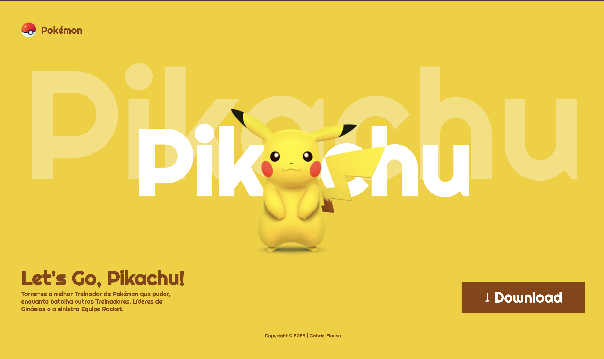

# Pikachu-Senai-2025

🟡 Landing Page – Pikachu

Este projeto é uma landing page teste inspirada no universo Pokémon, com foco no personagem Pikachu. O objetivo foi criar uma interface vibrante e divertida, utilizando uma paleta de cores amarela e elementos que remetem ao estilo visual da franquia.

A página apresenta um design limpo e moderno, destacando o Pikachu em posição central, acompanhado do título “Let’s Go, Pikachu!” e um botão de download fictício para simular a chamada principal de ação (CTA).

O projeto foi desenvolvido com foco em layout responsivo, tipografia marcante e harmonia visual, servindo como um exercício prático de design de interface e estrutura de páginas promocionais.

🧩 Tecnologias utilizadas:

HTML5

CSS3

Design flat e minimalista inspirado em landing pages modernas

📍Objetivo: Praticar criação de interfaces estáticas e conceitos de identidade visual para personagens ou produtos de entretenimento.

📅 Desenvolvido por: Gabriel Sousa | 2025